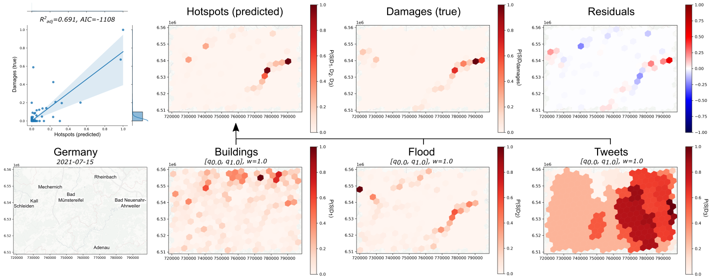

# H3H: Disaster hotspot analysis with H3
Immediately after a disaster strikes, it is crucial to quickly identify the most impacted areas to guide rapid response efforts and prioritise resource allocation effectively. Utilising early-stage estimations of impacted regions, derived from indicators such as building distribution, hazard zones or geo-social media reports, can aid in planning data collection initiatives to enhance situational awareness.

[H3H](https://github.com/MWieland/h3h) provides tools to compute and evaluate disaster hotspot maps. It leverages the [H3 discrete global grid system]() and uses a log-linear pooling method coupled with an unsupervised hyperparameter optimization to fuse heterogeneous geospatial information layers.



*Hotspot map computed with loglinear pooling at H3 resolution 7 from equally weighted normalized input layers (buildings, flooded areas, social media hotspots). Results are compared against an observed damage distribution for the flood disaster in Germany 2021.*

This publication provides further insight into the underlying algorithm and shows application examples and evaluations in real-world disasters.

```
Wieland, M., Resch, B., Schmidt, S., Abecker, A., Martinis, S. (under review). Fusion of geospatial information from remote sensing and social media to prioritize rapid response actions in case of floods. Natural Hazards.
```

If you use [H3H](https://github.com/MWieland/h3h) in your work, please consider citing the above publication.

## How to use it
Main modules are executed via `h3h` and settings are defined in a [TOML file](settings.toml). Run the following to get basic instructions for available modules.

```shell 
$ python -m h3h --help
```

### Hotspots
Computes disaster hotspots from heterogeneous geospatial datasets (raster, point, polygon) by means of a log-linear pooling. 

```shell 
$ python -m h3h --hotspots --settings path/to/settings.toml
```

This runs the following steps according to user-defined settings.

#### 1. Convert input layers to H3 grid 
Input layers are converted to H3 grid at desired resolution. Conversion of **raster layers** is done by summing the raster values inside each H3 grid cell. Conversion of **vector point layers** is done by summing the point values inside each grid cell. Conversion of **vector polygon layers** is done by assigning the polygon value at the centroid of each H3 grid cell.

> NOTE: Conversion to H3 grid is done on-the-fly (no need to run `--convert` before)

#### 2. Normalization
Values of converted input layers are normalized to range [0, 1] with a minmax scaler with rejection bounds. Setting `NORMALIZATION_QUANTILES` enables to scale to quantile range and reduce effect of extreme values.

> NOTE: Vector input layers require an attribute field with name "value", which will be used for normalization. E.g., to count the number of building points per grid cell, make sure to have an attribute column with name "value" and all values set to 1. 

#### 3. Log-linear pooling
The normalized H3 input layers are combined by using a loglinear pooling operator. Each layer is assigned a `POOLING_WEIGHT`, which controls their influence on the final result. Higher weight values generally refer to more focus. The result is a hotspot map with range [0, 1]. 

> NOTE: If `POOLING_WEIGHTS_AUTO=true`, optimal pooling weights are identified by minimizing the Kullback Leibler divergence between proxy information layers and predicted hotspots.

#### 4. Export and plot results
Hotspot maps and normalized H3 input layers are exported as Geopackage (.gpkg) files and plotted as maps (.png). 

### Convert
This is essentially the same layer conversion that is done as part of the `--hotspots` module. Can be useful if single layers need to be converted (e.g., true hotspots for comparison). 

```shell 
$ python -m h3h --convert --settings path/to/settings.toml
```

Input layers are converted to H3 grid at desired resolution. Conversion of **raster layers** is done by summing the raster values inside each H3 grid cell. Conversion of **vector point layers** is done by summing the point values inside each grid cell. Conversion of **vector polygon layers** is done by assigning the polygon value at the centroid of each H3 grid cell

> NOTE: Vector input layers require an attribute field with name "value", which will be used for normalization. E.g., to count the number of building points per grid cell, make sure to have an attribute column with name "value" and all values set to 1. 

### Compare
Compares H3 hotspots maps for an area of interest. Optionally, layers can be aggregated (downsample H3 resolution) and / or spatially smoothed. Also, comparison can be applied to the whole area of interest or just the spatial intersection of values between input layers.

```shell 
$ python -m h3h --compare --settings path/to/settings.toml
```

Evaluation metrics are computed on the basis of a linear regression between predicted and true hotspot values and include [adjusted R²](https://www.statsmodels.org/stable/generated/statsmodels.regression.linear_model.OLSResults.html#statsmodels.regression.linear_model.OLSResults), [Pearson correlation coefficient](https://www.statsmodels.org/stable/generated/statsmodels.regression.linear_model.OLSResults.html#statsmodels.regression.linear_model.OLSResults), [p-value](https://www.statsmodels.org/stable/generated/statsmodels.regression.linear_model.OLSResults.html#statsmodels.regression.linear_model.OLSResults), [Akaike's information criteria](https://www.statsmodels.org/dev/generated/statsmodels.regression.linear_model.OLSResults.aic.html) and [Bayes' information criteria](https://www.statsmodels.org/dev/generated/statsmodels.regression.linear_model.OLSResults.bic.html).

> NOTE: For a fair comparison, make sure to use the same `AREA_OF_INTEREST` for `--hotspot` calculation and `--compare`. If the normalization of true and predicted hotspots is based on different spatial extents, they are non comparable or at least the results are biased.

> NOTE: Aggregation is done by averaging values at lower resolution. It is, moreover, applied to hotspots and therefore produces different results than computing the hotspots directly from lower resolution input layers.

### Grid search
Runs a grid search over a set of user-defined parameter search spaces. 

```shell 
$ python -m h3h --gridsearch --settings path/to/settings.toml
```

Currently, search space can be defined for `POOLING_WEIGHTS`, `NORMALIZATION_QUANTILES` and `H3_RESOLUTION`. For each parameter combination a hotspot map is computed and compared against a true hotspot map (`LAYER_TRUE`). The true hotspot map is generated on the fly for each parameter combination to account for specific resolution and normalization quantiles. The module returns a hotspot map and comparison plots for each parameter combination as well as a summary table of the results.

> NOTE: Add precomputed normalized H3 input layers for the desired H3 resolution into `OUT_DIR` for faster processing. This loads the layers instead of converting them.

> NOTE: Use the [explore_parameters.ipynb](notebooks/explore_parameters.ipynb) notebook to explore the results of the parameter grid search and identify most suitable parameter values for the given scenario (pooling weights and normalization quantiles).

## Installation
```shell
$ conda create -n h3h python=3.11
$ conda install rasterio geopandas
$ pip install h3 h3pandas statsmodels toml tqdm contextily ukis-pysat pystac-client planetary-computer dask[complete] dask-geopandas adls odc-stac
```

## Test data
The [testdata](testdata/) directory contains input files for the Germany floods 2021. The data can be used for tests and to see how original input layers need to be prepared to work with [H3H](https://github.com/MWieland/h3h).

### OpenStreetMap building footprints (before disaster)
- Type: Vector Points (Geopackage)
- File: [buildings_20210715.gpkg](testdata/buildings_20210715.gpkg)
- Source: [OpenStreetMap](https://www.openstreetmap.de)

### Twitter hotspots (during disaster)
- Type: Vector Polygons (Geopackage)
- File: [twitter_20210715.gpkg](testdata/twitter_20210715.gpkg)
- Source: [Z_GIS Twitter analysis]()

### Flooded areas (during disaster)
- Type: Raster binary mask (GeoTIFF)
- File: [flood_20210715.tif](testdata/flood_20210715.tif)
- Source: [DLR Sentinel-1 flood mapping](https://ieeexplore.ieee.org/document/9714780)

### Damage data from CopernicusEMS (during disaster)
- Type: Vector Points (Geopackage)
- File: [damage_20210715.gpkg](testdata/damage_20210715.gpkg)
- Source: [Copernicus Emergency Mapping Service (EMSR517)](https://emergency.copernicus.eu/mapping/list-of-components/EMSR517)