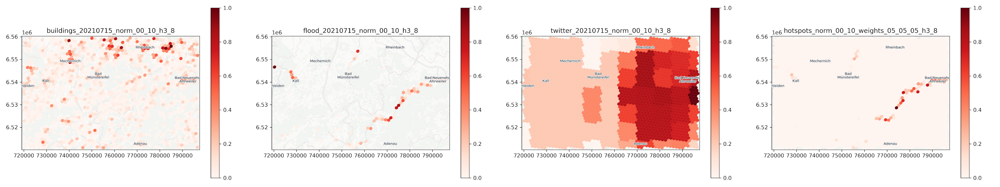
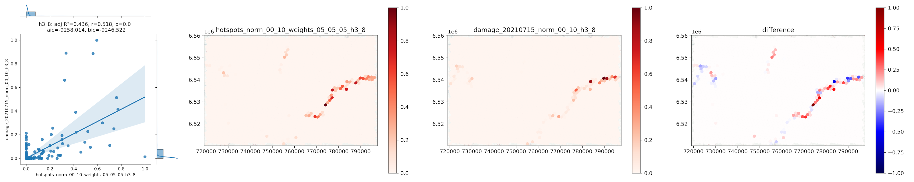
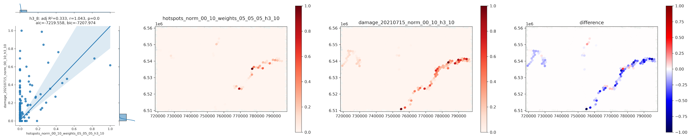
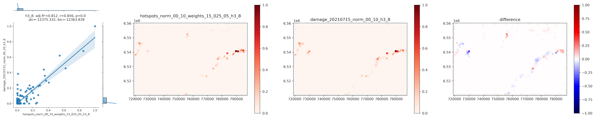

# H3H: Hotspot analysis with H3
Compute hotspot (focus) maps from heterogeneous input rasters. Provides routines to convert raster and vector data to h3 layers, to normalize (map) and pool h3 layers and to compute a hotspot (focus) map. Also routines to evaluate the quality of a hotspot maps by comparing predicted and true hotspot maps are provided.



*Hotspot map (right) computed with loglinear pooling at h3 resolution 8 from equally weighted normalized input layers (buildings, flooded areas, twitter hotspots)*

> *NOTE*: THIS REPOSITORY IS NOT MAINTAINED ANYMORE! For latest developments please go to: https://github.com/MWieland/h3h 

## Hotspots
Computes disaster hotspots from heterogeneous input layers (raster, point, polygon). 

### 1. Convert input layers to h3 grid 
Input layers are converted to h3 grid at desired resolution as follows: 
- Conversion of raster layers is done by summing the raster values inside each h3 grid cell
- Conversion of vector point layers is done by summing the point values inside each grid cell 
- Conversion of vector polygon layers is done by assigning the polygon value at the centroid of each h3 grid cell

> NOTE: Conversion to h3 grid is done on-the-fly (no need to run 'convert' before)

### 2. Normalize h3 input layers
Values of converted input layers are normalized to range [0, 1] with a minmax scaler with rejection bounds. Setting NORMALIZATION_QUANTILES enables to scale to quantile range and reduce effect of extreme values. Reasonable values for NORMALIZATION_QUANTILES are [0.0, 1.0] to use absolute minmax values.

> NOTE: Vector input layers require an attribute field with name "value", which will be used for normalization. E.g. to count the number of building points per grid cell, make sure to have an attribute column with name "value" and all values set to 1. 

### 3. Pool (map) normalized h3 input layers
The normalized h3 input layers are combined by using a loglinear pooling operator as proposed by [Pittore, M. (2015): Focus maps: a means of prioritizing data collection for efficient geo-risk assessment. - Annals of Geophysics, 58, 1, S0107](https://www.annalsofgeophysics.eu/index.php/annals/article/view/6692). Each layer is assigned a POOLING_WEIGHT, which controls their influence on the final result. Higher weight values generally refer to more focus. The result is a hotspot (or focus) map with range [0, 1]. If `POOLING_WEIGHTS_AUTO=true`, optimal pooling weights are identified by minimizing the Kullback Leibler divergence between proxy information layers and predicted hotspots.

### 4. Export and plot hotspots and normalized h3 input layers (optional)
Hotspot results and optionally the normalized h3 input layers are exported as Geopackage (.gpkg) files and plotted as maps (.png). 

## Convert
This is essentially the same layer conversion that is done as part of the hotspots module. Can be useful if single layers need to be converted (e.g., true hotspots for comparison).

Input layers are converted to h3 grid at desired resolution as follows: 
- Conversion of raster layers is done by summing the raster values inside each h3 grid cell
- Conversion of vector point layers is done by summing the point values inside each grid cell 
- Conversion of vector polygon layers is done by assigning the polygon value at the centroid of each h3 grid cell

> NOTE: Vector input layers require an attribute field with name "value", which will be used for normalization. E.g. to count the number of building points per grid cell, make sure to have an attribute column with name "value" and all values set to 1. 

## Compare
Compares h3 hotspots maps for an area of interest. Optionally, layers can be aggregated (downsample h3 resolution) and / or spatially smoothed. Also, comparison can be applied to the whole area of interest or just the spatial intersection of values between input layers. Evaluation metrics are computed on the basis of a linear regression between predicted and true hotspot values and include [adjusted R²](https://www.statsmodels.org/stable/generated/statsmodels.regression.linear_model.OLSResults.html#statsmodels.regression.linear_model.OLSResults), [Pearson correlation coefficient](https://www.statsmodels.org/stable/generated/statsmodels.regression.linear_model.OLSResults.html#statsmodels.regression.linear_model.OLSResults), [p-value](https://www.statsmodels.org/stable/generated/statsmodels.regression.linear_model.OLSResults.html#statsmodels.regression.linear_model.OLSResults), [Akaike's information criteria](https://www.statsmodels.org/dev/generated/statsmodels.regression.linear_model.OLSResults.aic.html) and [Bayes' information criteria](https://www.statsmodels.org/dev/generated/statsmodels.regression.linear_model.OLSResults.bic.html).

> NOTE: For a fair comparison, make sure to use the same AREA_OF_INTEREST for HOTSPOT calculation and for COMPARE. If the normalization of true and predicted hotspots is based on different spatial extents, they are non comparable or at least the results are biased.

> NOTE: Aggregation is done by averaging values at lower resolution. It is, moreover, applied to hotspots and therefore produces different results than computing the hotspots directly from lower resolution input layers.



*Results for h3 resolution 8 (not aggregated) - hotspots were computed from input layers at h3 resolution 8*



*Results for h3 resolution 8 (aggregated) - hotspots were computed from input layers at h3 resolution 10 and than aggregated to h3 resolution 8*

## Grid search
Runs a grid search over a set of user-defined parameter search spaces. Currently, search space can be defined for POOLING_WEIGHTS, NORMALIZATION_QUANTILES and H3_RESOLUTION. For each parameter combination a hotspot map is computed and compared against a true hotspot map (LAYER_TRUE). The true hotspot map is generated on the fly for each parameter combination to account for specific resolution and normalization quantiles. The module returns a hotspot map and comparison plots for each parameter combination as well as a summary table of the results.

> NOTE: Add precomputed normalized h3 input layers for the desired h3 resolution into OUT_DIR for faster processing. This loads the layers instead of converting them.

> NOTE: Use the [explore_parameters.ipynb](notebooks/explore_parameters.ipynb) notebook to explore the results of the parameter grid search and identify most suitable parameter values for the given scenario (pooling weights and normalization quantiles).



*Results for h3 resolution 8 with optimized values for POOLING_WEIGHTS and NORMALIZATION_QUANTILES. hotspots_### is the predicted hotspots map, damage_### is the true damage distribution from CopernicusEMS.*

## Installation
```shell
$ conda create -n h3h python=3.11
$ conda install rasterio geopandas
$ pip install h3 h3pandas statsmodels toml tqdm contextily ukis-pysat pystac-client planetary-computer dask[complete] dask-geopandas adls odc-stac
```

## Test data
The directory [testdata](testdata/) contains input files for the Germany floods 2021. The data can be used for tests and to see how original input layers need to be prepared to work with [h3h](h3h/).

### OpenStreetMap building footprints (before disaster)
- Type: Vector Points (Geopackage)
- Preparation: Convert Polygons to Points, reproject to epsg:3857, clip to AOI, add column "value" with 1 (required for conversion to h3)
- Description: Need to get OSM data BEFORE the disaster date. For example in Ahr valley many buildings were destroyed and removed. This is updated in OSM and would bias the results. 
- File: [buildings_20210715.gpkg](testdata/buildings_20210715.gpkg)
> Here we combined latest OSM with CopernicusEMS buildings to get the pre-disaster state of the building stock. Added the CopernicusEMS buildings that were not (anymore) in OSM.

### Twitter hotspots (during disaster)
- Type: Vector Polygons (Geopackage)
- Preparation: clip to AOI, rename "z_score" to "value" 
- Description: Aggregated and relevance classified tweets. 
- File: [twitter_20210715.gpkg](testdata/twitter_20210715.gpkg)

### Flooded areas (during disaster)
- Type: Raster binary mask (GeoTIFF)
- Preparation: buffer reference water mask, clip water mask with reference water, extract temporary flooded areas ([prepare_water.py](prepare_water.py))
- Description: Temporary flooded areas.
- File: [flood_20210715.tif](testdata/flood_20210715.tif)

> NOTE: Here the flooded areas do not represent the maximum inundation extent. Flood masks are from the closest date to the maximum extent.

### Damage data from CopernicusEMS (during disaster)
- Type: Vector Points (Geopackage)
- Preparation: clip to AOI, rename "damage_grade" to "value" 
- Description: Building damages provided by CopernicusEMS. "True" hotspots for comparison. 
- File: [damage_20210715.gpkg](testdata/damage_20210715.gpkg)

### Damage data area of interest from CopernicusEMS (during disaster)
- Type: Vector Polygons (Geopackage)
- Preparation: compute and save extent of detailed aois
- Description: Extent of area analyzed by CopernicusEMS. 
- File: [damage_aoi_20210715_extent.gpkg](testdata/damage_aoi_20210715_extent.gpkg)
